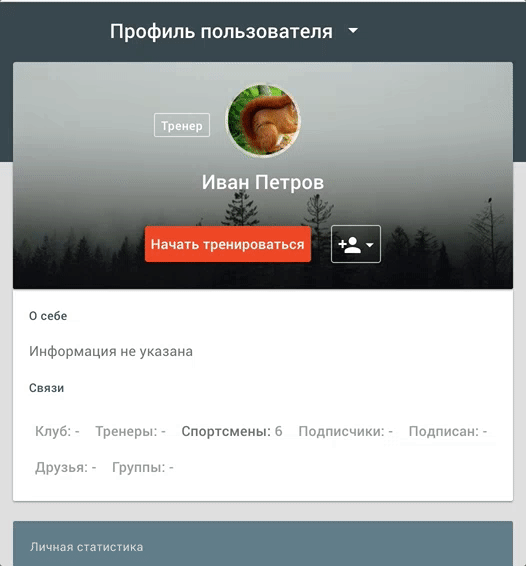

# Подключиться к тренеру или клубу

### Индивидуальные тренеры и тренерские клубы
**Тренер** - пользователь Стаминити, которому доступна возможнось тренировки других пользователей сервиса. Существуют два типа тренеров: индивидуальный тренер и тренер в клубе.
* **Индивидуальный тренер** - тренер, который удаленно занимается со спортсменами вне рамок клуба. Он управляет своим перечнем спортсменов: может принять заявку от спортсмена, либо перестать тренировать ученика.  
* **Тренер в клубе** - тренер, который является членом тренерского клуба и занимается со спортсменами клуба, назначенными для него клубом. 
 
Спортсмен может направить запрос на начало совместных тренировок с индивидуальным тренером, либо запрос клубу на вступление в клуб. Отправка запроса напрямую тренеру в клубе невозможна.

### Отправить запрос тренеру
Запрос тренеру выполняется из его профиля. 

Необходимо перейти в профиль тренера по ссылке, полученной от тренера, и нажать на "Начать тренироваться".

### Отправить запрос на вступление в клуб
adsfa

### Просмотреть статус запроса
asdfad
