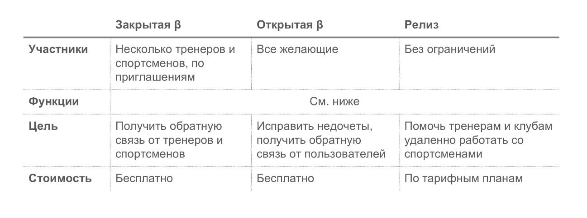
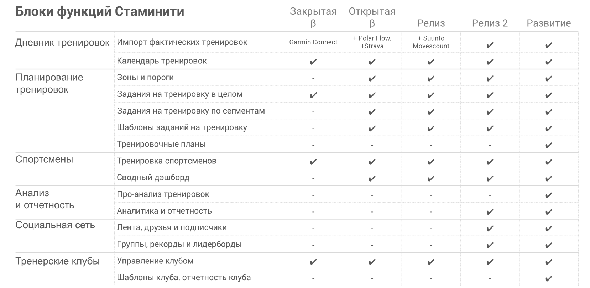

# Что такое закрытая бета

Закрытая бета - это одна из промежуточных стадий создания Стаминити. 

Участие в **закрытой бете** производится по приглашениям, число участников ограничено. 
Цель стадии: получить обратную связь от тренеров и спортсменов.

Функции в приложение будут добавляться постепенно, план развития Стаминити по релизам приведен ниже:

В **закрытую бету** входят базовые функции по удаленной работе тренера со спортсменами в Стаминити, это первая стадия создания приложения.

* Тренер для спортсмена или спортсмен сам для себя смогут **создать плановые тренировки**. В закрытой бете сделана поддержка создания плана в целом на тренировку, а планирование по отдельным тренировочным сегментам, ведение индивидуальных тренировочных зон и порогов и использование шаблонов тренировок при планировании будут реализованы к публичной бете.

* Запланированные тренировки можно выполнить в спортивных часах и фактические данные будут автоматически импортированы в Стаминити. В закрытой бете реализован **автоматический импорт из Garmin Connect**, а в публичной бете добавятся автоматический импорт из Strava и Polar flow, а также загрузка из файлов.

* Запланированные и фактически выполненные тренировки составят основу **тренировочного календаря** спортсмена. 

Также в закрытую бету входит поддержка 

* **Работа тренера со спортсменом** войдет в закрытую бету. Можно отправить заявку на подключение к тренеру,  

